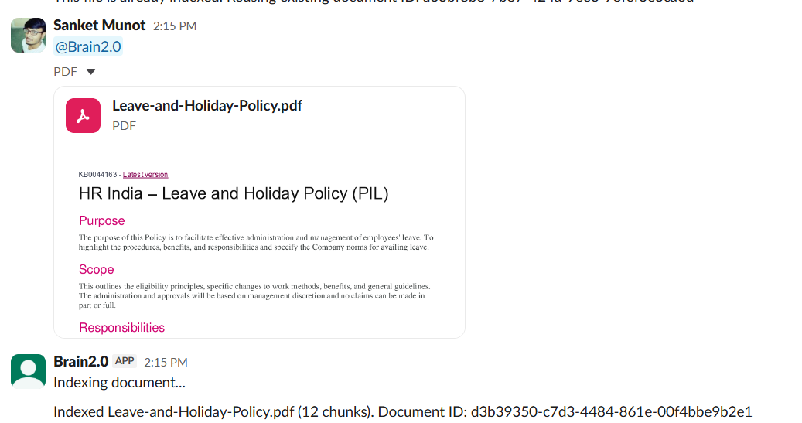
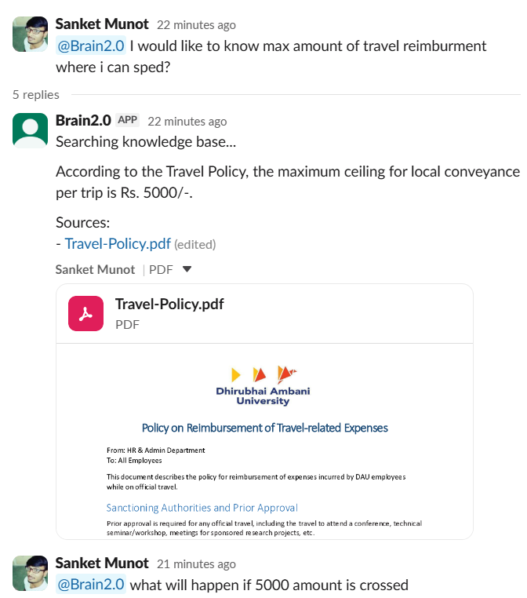
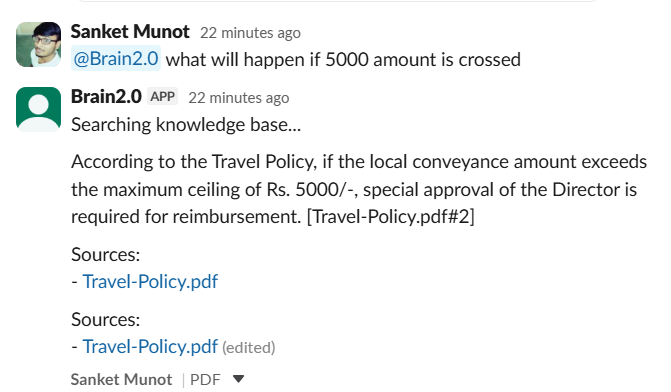

Project Name: Brain 2.0
Github Username: sanketmunot
Linkedin: https://www.linkedin.com/in/sanket-munot/
Repo: https://github.com/sanketmunot/buildathon-mastersunion-reacthyderabad

Problem Statement: AI Customer Support Intelligence System
Project Description:
- What is the project about? Brain 2.0 is an AI-powered customer support intelligence system that improves how teams handle and analyze customer queries.
- Who is it for? It is built for support teams, operations managers, and businesses that deal with high volumes of customer tickets.
- What problem does it solve? It solves slow, inconsistent, and manual support workflows by organizing conversations and surfacing relevant context.
- How does it help the user? It helps users by suggesting smarter responses, reducing resolution time, improving response quality, and enabling data-driven support decisions.

Approach:
- How you understood the problem: I focused on common support-team pain points, such as scattered knowledge, repeated questions, delayed responses, and lack of context in fast-moving conversations.
- What user flow you designed: A Slack-native flow where users mention the bot to ask questions, upload files to build the knowledge base, and request quick summaries for indexed documents.
- What features you decided to build: Document/file ingestion, chunking and indexing, semantic retrieval, citation-backed answers, thread memory, and summary generation.
- How AI is used in your solution: AI embeddings (Ollama) convert content into vectors for semantic search, and an LLM (Groq via LangChain) generates grounded answers from retrieved context.
- What makes your approach useful or different: It combines workflow-native support in Slack, relationship-aware retrieval, and citation-first responses to improve trust, speed, and accuracy.

Tech Stack and Tools Used:
- Frontend: Slack interface (Slack app interactions); no separate web frontend in this MVP.
- Backend: Node.js, TypeScript, Express, Slack Bolt, LangGraph.
- Database: LanceDB (with local JSON fallback index), local file storage for uploads.
- AI Tools/API: Groq Chat Completions API, Ollama (`nomic-embed-text`), LangChain.
- Cloud/Deployment: Local development setup (Socket Mode + local server); deployment-ready for cloud hosting.
- Other Tools: Cursor, GitHub, dotenv, Postman-style API testing via local endpoints.

Key Features:
- Slack mention-based Q&A (`@bot <question>` style interaction).
- Slack file ingestion pipeline (`file_shared`) for knowledge indexing.
- Chunking + embedding + vector retrieval for relevant context selection.
- Grounded responses with source citations.
- Document summary command (`summary <documentId>`).
- Short conversation memory for better thread continuity.

What is Working?
- Slack bot connection and Socket Mode setup are working.
- Ingestion of text/files into storage and index is working.
- Semantic retrieval and citation-backed answer generation are working.
- API endpoints for ingest and ask flows are working.
- Summary flow for indexed documents is implemented and functional.

What is Still in Progress?
- Better ranking and reranking to further improve answer precision.
- Richer UI/dashboard for support analytics beyond Slack interactions.
- Broader file/source connectors (e.g., external docs/wiki/helpdesk systems).
- Production hardening: monitoring, scaling strategy, and deployment automation.
- More extensive testing and evaluation on larger real-world support datasets.

Screenshots or Demo:
- Deployed Link: Not available yet (currently running locally).
- Demo Video Link: To be added.
- Screenshots:
  - Ingestion of a document 
  
  - User asking a query
  
  - User asking more details in thread where the memory is persisted
  

Learnings:
- Slack bot integration: Learned how to integrate a Slack app using Bolt with Socket Mode, handle events like mentions/file uploads, and design a smooth chat-first support workflow.
- LangGraph: Learned how to structure multi-step AI pipelines as graph nodes (intent, retrieval, answer, summary), making the workflow modular and easier to debug.
- Ingestion pipeline: Learned to build robust ingestion from user-provided content into chunks and metadata so knowledge can be indexed and retrieved effectively.
- LanceDB: Learned practical vector database usage for semantic retrieval, including indexing, local persistence, and fallback strategies for reliable MVP behavior.

Future Improvements:
- Add ingestion from images using OCR so screenshots, scanned documents, and image-based support material can also be indexed and queried.
- Add ingestion from websites by crawling/scraping documentation pages, knowledge bases, and FAQ portals for automatic source expansion.

Final Note:
- This project was built as a practical MVP focused on real support-team workflows: fast ingestion, grounded answers, and better response quality inside Slack.
- The current version is designed for quick iteration and validation, and the next phase is focused on broader source coverage, stronger retrieval quality, and production readiness.
